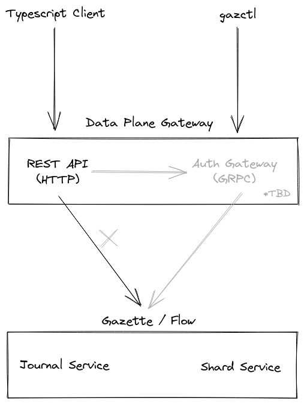

# Data Plane Gateway

[Gazette](https://github.com/gazette/core) exposes several GRPC services we'd like to provide broader access to.
1. We'd like to expose REST versions of these services.
2. We'd like to enforce authentication and authorization. Coming soon:tm:.

## REST Gateway

We use the [grpc-gateway](https://github.com/grpc-ecosystem/grpc-gateway/) project to generate REST handlers from the protobuf definitions found in Gazette. We also generate Swagger documentation which we then use to generate a TypeScript client.

#### Components

* `{broker,consumer}_service.yaml` define which RPCs are exposed as REST handlers.
* `gen/` houses all the files generated by `grpc-gateway`.
* `main.go` wires up the generated REST handler code into a single server.
* `client/` defines a TypeScript/JavaScript library that can interact with the REST api.
* `build.sh` wrangles all the configuration options for building the gateway.
* `test.sh` launches a local Flow data plane, the gateway, and runs the client tests against it.

## Auth Gateway

This will verify authentication and enforce authorization of calls. Not yet implemented.
